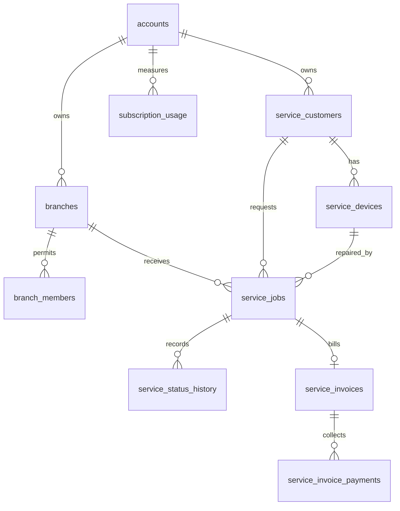

# Service Center Platform Architecture

## Tenant hierarchy

`accounts` is the company/tenant boundary already used by WACRM. Every service-center table includes `account_id`; branch-scoped records also include `branch_id`. Supabase RLS uses `is_account_member(account_id)` so one company cannot read another company's records.

## Application layers

- Presentation: Next.js dashboard, customer web, and a future mobile client.
- Application/API: authenticated route handlers validate input, enforce account/branch permissions, apply subscription limits, and call integrations.
- Database: Supabase PostgreSQL, RLS, migrations, indexes, immutable status history, and usage counters.

## Delivery order

1. Foundation: companies/accounts, branches, members, service customers/devices, RBAC mapping, and usage records.
2. Service operations: category and job APIs, assignment, status transitions, tracking URL, and timeline.
3. Finance: quotations, invoices, payments, receipts, and PDF generation.
4. Integrations: branch WhatsApp configuration, template rendering, delivery logs, and notifications.
5. SaaS controls: plan limits, trials, Razorpay renewal, usage enforcement, and Super Admin reporting.